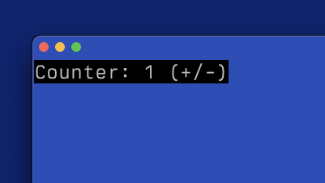

#+TITLE: CELLIUM BASIC THEORY
#+FILETAGS: :systems:

#+OPTIONS: ^:nil num:nil toc:nil date:nil author:nil html-postamble:nil
#+SETUPFILE: "./setupfile.org"
#+INCLUDE: "navbar.html" export html
#+HTML_HEAD: <meta name="description" content="Introduction to cellium concepts" />

* Summary:
:PROPERTIES:
:ID:       CC48A4BC-1999-4D79-BF88-974CAD5F7606
:PUBDATE:  2026-03-12 Thu 04:23
:END:

I started building [[https://github.com/wmealing/cellium][Cellium]], a TUI (Text-User Interface) library for Erlang, because I got fed up with the complexity of building
basic user interfaces for my Erlang tooling. It's an itch I needed to scratch.

* Introduction
:PROPERTIES:
:ID:       80F9951B-ACC2-4809-954E-A1713A8A90F9
:PUBDATE:  2026-03-12 Thu 04:23
:END:

Look, I'm not entirely sure who I'm writing this for. It feels like throwing a message in a bottle onto the internet,
Google's certainly not indexing it, so maybe this is a complete waste of time. But here we are.

Erlang will always be a language close to my heart. Sure, it has its flaws ( the things I'd love to fix... ) but most of those
"fixes" are just things I care about and are not suitable for upstream submission.

The real driver for Cellium is this: setting up a full web stack—webserver, HTML, CSS, and security—just to give a basic
interface to a piece of tooling is the absolute definition of *too much work for too little gain*.

So, the idea was born: use [[https://github.com/termbox/termbox2][termbox2]] as the foundation for console interaction. I'm okay with digging into C when needed,
so I wasn't too worried about adding a few features to the existing 'termbox2_nif' Erlang library.

I quickly whipped up an "event manager," a "render server," and a "state server." I even tweeted about it [[https://x.com/WadeMealing/status/1972691136163561786][here]], and it
got the engagement it deserved (zero). But like the stubborn idiot I am, I kept going.

Then I stumbled upon the **"TEA" (The Elm Architecture)** concept, a much cleaner way to structure an application. The
core idea is centered around three main functions:

#+BEGIN_SRC erlang
init() ->
    %% Initial setup goes here.
    Model = ....
    {ok, Model}.

update(Model, Msg) ->
    %% This takes the old Model and a Message (user input/event)
    %% and returns a NewModel.
    NewModel = ,
    {ok, NewModel}

render(Model) ->
    %% This takes the Model and applies it to the 'view' (the TUI layout)
    {ok, whatever}
#+END_SRC

This model was perfect! I could hook my event manager into =update= (sending events as messages) and adapt my widget code in =render= to draw
the layout based on the current =Model=. I got it working in short order.

I thought surely, someone had done this, I googled "TEA" for Erlang and found [[https://github.com/ndreynolds/ratatouille][Ratatouille]]. They had almost the exact same naming and plan. Turns out,
they've been at this for a while and probably have a much more mature understanding of the problem. Both Elixir and Gleam (fantastic
alternative languages that also run on the Erlang [[https://en.wikipedia.org/wiki/BEAM_(Erlang_virtual_machine)][BEAM]]) have working, mature TEA-based TUI alternatives: [[https://github.com/ndreynolds/ratatouille][Ratatouille]] and [[https://github.com/bgwdotdev/shore][Shore]].

They are miles ahead of me. They've got mature implementations, and those languages likely have more users than Erlang anyway. But you know what?
My special brand of idiocy continues.

My first smart move was to stop reinventing the wheel and borrow from those who have come before me. I based Cellium's basic structure and README
example on Ratatouille's approach.  I looked at the examples.

** The Cellium Example
:PROPERTIES:
:ID:       FFC3700D-436F-479E-A389-4B4530F9786B
:END:

The resulting basic counter example looks pretty similar to their [[https://github.com/ndreynolds/ratatouille/blob/master/examples/counter.exs][Elixir version]]:

#+BEGIN_SRC erlang
-module(counter).

-behavior(cellium).

-export([init/1, render/1, update/2, start/0]).

init(_Args) ->
    Model = #{count => 0},
    {ok, Model}.

update(#{count := Count} = Model, Msg) ->
    case Msg of
        {tb_event, key, _, {keydata, _, $+}} ->
            #{count => Count + 1};
        {tb_event, key, _, {keydata, _, $-}} ->
            #{count => Count - 1};
        {tb_event, key, _ , {keydata, _ , $q}} ->
            init:stop();
        _Other ->
            Model
    end.

render(#{count := Count}) ->
    Text = io_lib:format("Counter: ~p (+/-)", [Count]),

    %% Must return a container, not just a single widget.
    #{
        type => container,
        orientation => horizontal,
        children => [
            #{
                type => widget,
                widget_type => text,
                value => Text
            }
        ]
    }.

start() ->
    cellium:start(?MODULE).
#+END_SRC

I wrapped a little bit of 'handling' logic in a custom behavior (thanks to [[https://medium.com/erlang-battleground/erlang-behaviors-d5bb30d5412b][this document]]) to present the minimal API surface to the programmer.

And here's what it looks like in action:

#+ATTR_ORG: :align center

* Current Hurdles.
:PROPERTIES:
:ID:       C4939625-2C21-4692-BEB1-67824C2CF6C6
:PUBDATE:  2026-03-12 Thu 04:23
:END:

While the core concept is sound, Erlang throws up a few unique roadblocks compared to Elixir.

**Elixir allows Top-Level Code Execution.**

In Elixir, they can run a line like =Ratatouille.run(Counter)= right after defining the module. That's a slick way to launch a demo. Erlang doesn't let you do this. You can play with =-on_load= attributes, but the programmer still needs to actively trigger the module load, so you're back to square one.

Maybe I'll need to write a nice application wrapper to manage the startup process gracefully.

**The Erlang Shell Problem.**

The Ratatouille folks seem to have solved the notorious "Erlang shell problem." This is where the standard Erlang shell corrupts your terminal output and sometimes swallows input. My own workaround was to run Erlang with the =-noshell= parameter:

#+BEGIN_SRC erlang
$ erl -noshell -sname node1 -setcookie mysecretcookie .... etc
#+END_SRC

This stops the shell from interfering, but it also means you lose your REPL (Read-Eval-Print Loop).

Fortunately, Erlang is a distributed language at its core, allowing for an easy connection to a remote shell, given some [[https://www.erlang.org/doc/apps/erts/erl_cmd.html][command line parameters]]. As an Emacs user, I came up with this clever little function to maintain a quick "EDIT -> COMPILE -> VIEW" loop:

#+BEGIN_SRC elisp
(defun remote-erlang-shell ()
  "Starts an inferior Erlang shell with a randomized -sname using a random string."
  (interactive)
  (let* (
           (chars "abcdefghijklmnopqrstuvwxyzABCDEFGHIJKLMNOPQRSTUVWXYZ0123456789")
           (len 5) ; Length of the random part (e.g., 5 characters)
           (random-part (with-temp-buffer
                            (dotimes (i len)
                              (insert (aref chars (random (length chars)))))
                            (buffer-string)))
           (random-name (concat "node-" random-part))
           (command (format "erl -sname %s -setcookie mysecretcookie -remsh node1" random-name)))
    (inferior-erlang command)))
#+END_SRC

When I run =M-x remote-erlang-shell= in Emacs, it starts a new shell connected to my running TUI node (='node1'=). Now, when I edit a file and hit ='c-c c-k'=, the code compiles directly into the live, running remote server. **Live code updates are awesome!**

Still, The Rat has found a better way, and I need to figure out how.

[Update: I have just found out that you can't embed a NIF in an [[https://www.rebar3.org/docs/commands/#escriptize][Escriptized]] application, which could be another reason to remove the dependency.]

**Using termbox2.**

The Gleam library, [[https://github.com/bgwdotdev/shore][Shore]], appears to avoid termbox2. While the Shore code is pretty complex to fully grasp quickly, it seems they might be using
Erlang's native [[https://www.erlang.org/doc/apps/stdlib/io.html#get_chars/2][io:get_chars]] to handle input without the shell interference. Shore's [[https://github.com/bgwdotdev/shore/blob/fe5d62b16b17549f461b3af3d9fd805f3be447af/src/shore/internal.gleam#L742][renderer]] looks straightforward enough, and if I can get the
core logic down, adopting their rendering concept will perhaps allow moe to remove termbox2 as a depenency.

* Where Cellium Differentiates
:PROPERTIES:
:ID:       5282F255-48D2-40A4-86CE-6BBC880D35B3
:PUBDATE:  2026-03-12 Thu 04:23
:END:

I'm not  copying; there are a few areas where I want Cellium to be different.

*** "CSS-Like" Theming Engine:
:PROPERTIES:
:ID:       65C3E8A8-EA0F-45A5-A805-0ADC663DF3FF
:END:

I'm working on a theming engine that applies attributes to widgets, similar to how CSS works. The idea is to make
theme edits live and easy. Of course, CSS attributes should *overwrite* coded values—that's what the C in CSS stands for (Cascading!), right? 😉

*** *Robust Crash Handling:*
:PROPERTIES:
:ID:       713ECEFD-E310-43F7-9BD4-1E75FB94D7D9
:END:

I want to be absolutely sure that if an =update= function fails, the rest of the system keeps running smoothly. This will be a core part of my test suite.

*** *It's Pure Erlang:*
:PROPERTIES:
:ID:       A68B54D1-DE77-40E8-9362-898E61CB0ECC
:END:

The simple fact that I can't find another mature TUI library written purely in Erlang appears to be the motivation enough for me to keep going.

* What's Next?
:PROPERTIES:
:ID:       8E4E01B9-A8FF-4FB1-A44F-07969A9164CF
:PUBDATE:  2026-03-12 Thu 04:23
:END:

I should look at adopting a better event format. The termbox2_nif  messages aren't the clearest. [[https://github.com/ndreynolds/ratatouille/issues/6][The Ratatouille project]] has a great idea for standardizing TUI events. If I can use a cleaner event format, maybe I can even drop the direct termbox messages and just use their event structure natively.

* Conclusion
:PROPERTIES:
:ID:       71B73A90-1B84-468E-8D36-C697AB8531F6
:PUBDATE:  2026-03-12 Thu 04:23
:END:

I've laid out the current state of Cellium and talked through the key issues—Erlang's quirks and the realization that
others have done this before. I'll keep plugging away at this, even if I never get a single user and my writings remain
on github.

* Resources:
:PROPERTIES:
:ID:       A524DED3-8ADF-4DF2-BEE7-692492993C04
:PUBDATE:  2026-03-12 Thu 04:23
:END:

https://github.com/termbox/termbox2

https://github.com/bgwdotdev/shore
