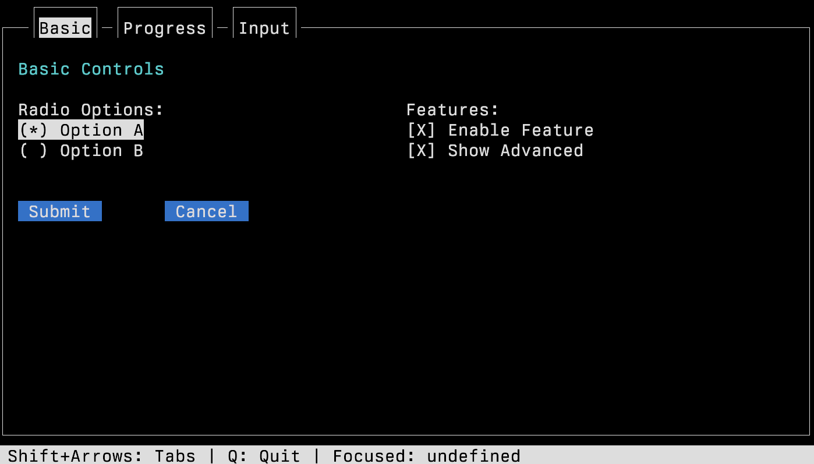
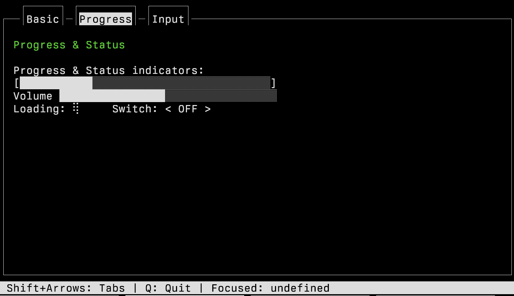
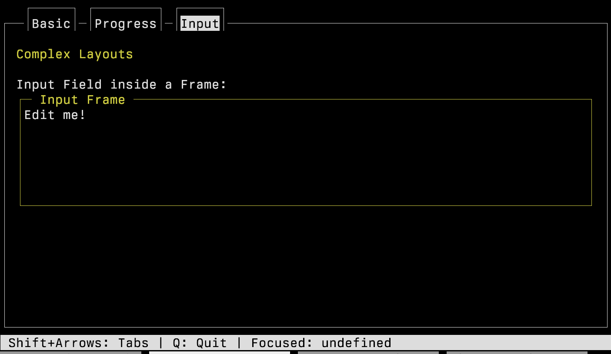

#+TITLE: CELLIUM 005 - Apr 2026

#+OPTIONS: ^:nil num:nil toc:nil date:nil author:nil html-postamble:nil
#+SETUPFILE: "./setupfile.org"
#+INCLUDE: "navbar.html" export html
#+FILETAGS: :systems:cellium:
#+HTML_HEAD: <meta name="description" content="Wade Mealings documentation" />

* Summary: Widget Gallery
:PROPERTIES:
:END:

I've recently updated the widget gallery for 'built in' widgets for cellium.

If you want to see the demo in action, check out my cellium project, rebar3 compile it, then run

#+BEGIN_SRC sh
$ make run example=widgets_gallery
#+END_SRC

* Introduction
:PROPERTIES:
:END:

*** Basic:

The first tab is radio buttons, checkboxes, and regular button, buttons.

The image also has a "tab", the current tab is "basic" and has a highlight, i was thinking maybe i should highlight the whole
tab |-----| part, but im on the fence at the moment.

#+ATTR_HTML: width 1000px
#+ATTR_ORG: :align center

*** Progress

Progress meters are useful, these use utf8, because if you're not using utf8 , i dont know what to say about that

- Unicode Character “█” (U+2588)
- Some lighter version of the same.

I did have [] and _ but this get complicated, and looked pretty bad.

Volume is different to progress, bceause it doesnt have the end cap [ ] on.  You interact with them both with the arrow keys.

Loading widget, you can't see it here, but those funky braile dots rotate, i'm probabaly breaking all kinds of accessibility
issues with it.

The switch, which is basically a fancy word for a toggle, i should probably move that over to basic. Its more of a button.

Too bad, the screenshots are taken so thats what you're getting.

#+ATTR_HTML:  width 1000px
#+ATTR_ORG: :align center

*** Inputs

This demonstrates a 'frame' widget, with the "Input frame" title.  If you hit tab a few times, the focus
will change to the contents of the "Input Frame" and you can just type into the text field, super obv.

#+ATTR_HTML:  width 1000px
#+ATTR_ORG: :align center

A hidden thing on every frame is the status bar, its the grey thing down the bottom, you can decide what
goes on it, choose the most obvious things you need for your users.

I also noticed that until you interact (aka hit tab), the focus manager assumes you're focus is undefined,
Maybe thats.. right ? Naming the focus in the status bar is not strictly necessary, I just put it there
to help with debugging.

* Conclusion
:PROPERTIES:
:END:

I'm definitely going to update this again later, when I have more .. widgets, but this is it for now.

