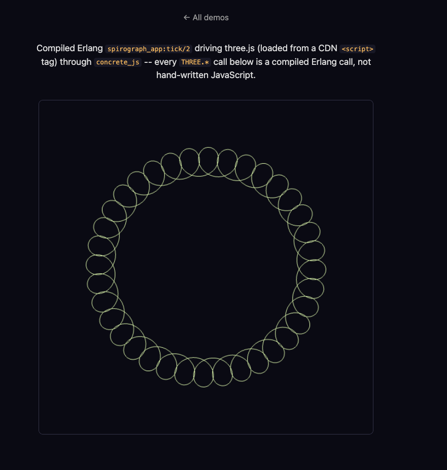

#+TITLE: CONCRETE 005: JavaScript Interop.
#+HTML_HEAD: <meta name="description" content="Calling an already-loaded JavaScript library, like three.js, from compiled Erlang" />
#+FILETAGS: :systems:erlang:concrete:

#+OPTIONS: ^:nil num:nil toc:nil date:nil author:nil html-postamble:nil
#+SETUPFILE: "./setupfile.org"
#+INCLUDE: "navbar.html" export html
#+HTML_HEAD: <meta name="description" content="Calling an already-loaded JavaScript library, like three.js, from compiled Erlang" />

* Summary:
:PROPERTIES:
:ID:       347FAADA-10E3-45E8-958C-2D732F6ED5EB
:PUBDATE:  2026-08-07 Fri 00:00
:END:

Every demo so far talks to the browser through a fixed set of hand-written BIFs: =dom:*=, =canvas:*=, =sse:*=, =http:*=. Each BIF wraps one native call. =canvas:arc/6= wraps =CanvasRenderingContext2D.arc=. This does not work for a real JavaScript library. This post covers =concrete_js=, a new module that calls into any code already loaded in the page. That code can come from three.js, from Chart.js, or from any other library loaded with a plain =<script>= tag. Concrete does not need to know about the library in advance.

* Why This Needs No Compiler Support
:PROPERTIES:
:ID:       58585352-414A-4FD1-A199-5A33026F0672
:PUBDATE:  2026-08-07 Fri 00:00
:END:

I expected this feature to need changes in the transformer and the encoder. It did not need either one. The reason is worth understanding before the module itself.

=concrete_encoder= compiles every remote call the same way, no matter which module the call names:

#+BEGIN_SRC erlang
encode_ir(#ir_remote_call{module = #ir_atom{value = M}, function = #ir_atom{value = F},
                           arity = A, args = Args}) ->
    ...
    io_lib:format("Erlang[~s](~s)",
        [encode_string(io_lib:format("~s:~s/~w", [M, F, A])),
         join([encode_ir(Arg) || Arg <- Args], ", ")])
#+END_SRC

=dom:append_html(Id, Html)= and =concrete_js:call(Receiver, Method, Args)= compile to the same shape: a string lookup into a flat JavaScript object, =Erlang["dom:append_html/2"]= or =Erlang["concrete_js:call/3"]=. There is no Erlang module named =dom=. The encoder does not need one named =concrete_js= either. It only needs the runtime's =Erlang= table to hold an entry with that exact key.

The call graph already treats a module with no BEAM abstract code as a dead end, not an error. A lookup into the PLT for =concrete_js:call/3= returns =not_found=. The walker adds the vertex, finds no further edges, and moves on. =concrete_encoder:encode_bundle/2= then skips encoding anything with no matching PLT entry. =concrete_js:*= calls get the same free ride =dom:*= and =canvas:*= already get. The only real module is =concrete_js.erl= itself. Its only job is to exist, so the functions have something to type-check against, and something safe to run if they ever run on the server. More on that below.

* The concrete_js Module
:PROPERTIES:
:ID:       1126A21E-8FEA-406D-BC1C-499736DCAD86
:PUBDATE:  2026-08-07 Fri 00:00
:END:

=concrete_js= exports seven functions: =call/2=, =call/3=, =new/2=, =get/2=, =set/3=, =delete/2=, =instanceof/2=, and =typeof/1=. A small three.js scene, built up piece by piece, uses most of them:

#+BEGIN_SRC erlang
Scene = concrete_js:new('THREE.Scene', []),
Geo   = concrete_js:new('THREE.BoxGeometry', [1, 1, 1]),
Mat   = concrete_js:new('THREE.MeshBasicMaterial', [#{color => 16711680}]),
Mesh  = concrete_js:new('THREE.Mesh', [Geo, Mat]),
concrete_js:call(Scene, add, [Mesh]).
#+END_SRC

=new/2= constructs a class. It returns a value you can pass into later calls. =call/3= calls a method on a value you already have. =call/2= does the same thing without a receiver, for a bare global function. =get/2=, =set/3=, and =delete/2= read, write, and remove a property. =instanceof/2= and =typeof/1= answer the same questions the matching JavaScript operators answer.

The example above takes more typing than the plain JavaScript it maps to: =scene.add(mesh)= against =concrete_js:call(Scene, add, [Mesh])=. I considered shortening the module name to =js=. I decided against it. Erlang has one flat, global module namespace, shared across every dependency an application pulls in. =js= is a short, common name. A project is likely to already use it for something of its own. A library should not claim a name that generic for everyone who depends on it. Upstream Hologram made the same choice: the module is =Hologram.JS=, not bare =JS=.

The real fix for the typing is project-local, not library-wide. =include/concrete_js.hrl= defines one macro: =-define(js, concrete_js).=. Include it, and the same scene reads closer to the JavaScript it calls:

#+BEGIN_SRC erlang
-include_lib("concrete/include/concrete_js.hrl").

Scene = ?js:new('THREE.Scene', []),
?js:call(Scene, add, [Mesh]).
#+END_SRC

A project opts into that =-include_lib= on its own. =concrete_js= does not force it on anyone. The rest of this post keeps using =?js= in examples, and the full =concrete_js= name when it means the module itself.

* Reaching a Library Already on the Page
:PROPERTIES:
:ID:       89265EF1-BFDE-4E9B-A080-FCF8E34804D2
:PUBDATE:  2026-08-07 Fri 00:00
:END:

='THREE.Scene'= above is not special syntax that Concrete parses. It is an ordinary Erlang atom, quoted because it is not a valid bare atom on its own. A =Receiver= or =ClassPath= argument is one of two things. It is a native handle, returned by an earlier =new/2=, =call/2=, =call/3=, or =get/2=. Or it is a dotted path, resolved against the browser's global scope, one segment at a time, starting from =globalThis=. That path can be a binary, =<<"THREE.Scene">>=, or an atom, ='THREE.Scene'=. =Method= and =Prop= arguments take the same choice. A plain lowercase atom, like =add=, needs no quoting at all.

Atoms read better for a name that is fixed at compile time. That is the normal case, so the examples in this post use atoms throughout. A binary works just as well. Both term shapes carry the same string, so the runtime does not care which one you send.

There is no import step. =concrete_js= does not fetch a package, resolve a version, or bundle anything. It assumes THREE is already a global, because a plain =<script>= tag, pointing at a CDN build of three.js, put it there before your compiled bundle ran. Pulling in an actual JavaScript module as a real dependency, the way Hologram's =js_import= does upstream, needs an ES-module loader. Concrete's build pipeline does not have one yet. That is future work, not this post.

* Handles: Values That Are Not Terms
:PROPERTIES:
:ID:       6B50BCC8-0E4B-44C2-AD06-AE73FB31CCFA
:PUBDATE:  2026-08-07 Fri 00:00
:END:

=Scene= and =Mesh= above are not Erlang terms in the normal sense. A =THREE.Scene= instance cannot become an integer, a binary, or a map. There is nothing to convert it into. The runtime boxes it as an opaque handle instead: a tagged 3-tuple, ={js_native, TypeAtom, Ref}=. =Ref= indexes a plain JavaScript =Map= the runtime keeps, from an integer to the real object. Passing the handle into a later call, =?js:call(Scene, add, [Mesh])=, looks the ref up and hands the real =THREE.Scene= back to the native call, unwrapped.

Primitive values box the way you would expect. Numbers become integers or floats. Strings become bitstrings. Booleans become the =true= and =false= atoms every other guard BIF already uses. Arrays become lists. Plain objects become maps with binary keys. The same conversion runs in reverse on the way into a call. A Concrete list argument becomes a real JavaScript array before the native function sees it. It does not arrive as a boxed term with a =.data= field. A function like one of three.js's own array-taking constructors gets exactly the argument shape it expects.

Handles never cross the wire. Compiled browser code is the only place they get created. =concrete_serializer= and =concrete_deserializer= never need to know they exist.

* Errors, and Running on the Server by Accident
:PROPERTIES:
:ID:       FDD03808-1D91-4E17-BDA9-21AC91700144
:PUBDATE:  2026-08-07 Fri 00:00
:END:

A native call that throws surfaces as ={js_error, Reason}=, an ordinary Erlang error. You can catch it with a plain =try= and =catch=. This is not a new error shape built for this feature. It is the same tuple the compiled =try= and =catch= runtime already raises for any uncaught native exception. Reusing it means you learn one error shape, not two.

=concrete_js.erl='s seven functions all have real bodies, not just specs. Every body is a harmless stub. =call/3= returns =undefined=. =set/3= returns its receiver unchanged. And so on. This matters because an =action/3= clause can run on the real BEAM, not only compiled and run in the browser. =concrete_ws_handler= dispatches an action over a WebSocket message straight to =concrete_runtime:dispatch_action/4=, which calls the real Erlang function. If that action calls =?js:call(...)=, the stub keeps the server process from crashing. =init/2= never re-runs client-side. Hydration only deserializes the state the server already sent. So this stub protects =action/3= specifically. That is the one place browser-only code and real server dispatch can meet.

* A Real Demo: A Spirograph in three.js
:PROPERTIES:
:ID:       4B1278D1-2C84-4AF1-9204-E9A8B7629599
:PUBDATE:  2026-08-07 Fri 00:00
:END:

The =Scene= and =Mesh= example earlier in this post is illustrative, not code you can run. =example/spirograph_app.erl= is real code, compiled through the actual pipeline, running in a real browser. It draws an animated, color-cycling spirograph: a ring of loops traced by three.js, loaded from a CDN =<script>= tag, entirely through =?js= calls.

The shape comes from a hypotrochoid: a small circle rolling inside a fixed one, tracing a point offset from its own center. A real Spirograph toy describes the same shape with gear teeth. A ring with 36 teeth and a wheel with 35 teeth, one tooth apart, draws a ring made of 36 thin overlapping loops around a hollow center, instead of a handful of fat petals. =spirograph_app.erl= uses that exact ratio.

#+BEGIN_SRC erlang
build_spirograph_line() ->
    Points = [?js:new('THREE.Vector3', [X, Y, 0.0]) || {X, Y} <- spirograph_points()],
    Geometry = ?js:new('THREE.BufferGeometry', []),
    ?js:call(Geometry, <<"setFromPoints">>, [Points]),
    Material = ?js:new('THREE.LineBasicMaterial', [#{color => 16#9CCCFF}]),
    Line = ?js:new('THREE.Line', [Geometry, Material]),
    {Line, Material}.
#+END_SRC

Each point is a real =THREE.Vector3=, a native handle, built by an ordinary Erlang list comprehension, then handed to =setFromPoints= as one Concrete list. The list unboxes to a real JavaScript array on the way in. Each handle inside it unboxes back to its own =THREE.Vector3=. three.js never sees a boxed term.

The loop count and the total sweep agree exactly: the curve closes after =?LOOPS= full turns, and =?T_MAX= sweeps through precisely that many turns, no more. Every one of the =?POINTS= points is a distinct part of the ring, not a second pass over ground already covered.

Each animation frame rotates the whole ring a little further, and shifts its color around the wheel:

#+BEGIN_SRC erlang
tick(World, Angle) ->
    #{line := Line, scene := Scene, camera := Camera,
      renderer := Renderer, material := Material} = World,
    Rotation = ?js:get(Line, <<"rotation">>),
    ?js:set(Rotation, <<"z">>, Angle),
    Color = ?js:get(Material, <<"color">>),
    ?js:call(Color, <<"setHSL">>, [hue(Angle), 0.8, 0.65]),
    ?js:call(Renderer, <<"render">>, [Scene, Camera]),
    dom:set_timeout(16, spirograph_app, tick, [World, Angle + 0.006]).
#+END_SRC

Same self-rescheduling shape the canvas flower demo already uses, just driving three.js instead of Canvas2D.

* Try It Yourself
:PROPERTIES:
:ID:       6C50BCC8-0E4B-44C2-AD06-AE73FB31CCFB
:PUBDATE:  2026-08-07 Fri 00:00
:END:

Start =rebar3 as example shell=, call =spirograph_demo:serve()=, and open =http://localhost:8773= in a browser. The ring spins in place and cycles color as it turns:

#+ATTR_HTML: :width 600px :style "display:block;margin:0 auto;"

Every line in that image came from a compiled Erlang call to three.js, not from any JavaScript written by hand.

* What Comes Next
:PROPERTIES:
:ID:       088C0927-4F65-47C6-809B-02F9DB334ABB
:PUBDATE:  2026-08-07 Fri 00:00
:END:

This post covered how compiled Erlang reaches an already-loaded JavaScript library, and why that needed almost no changes to the compiler. The next post covers a direct follow-up question: can Concrete catch a JavaScript Promise, the way Hologram's =Task.await/1= does upstream. Two other things are still missing. One is pulling in a JavaScript package as a real dependency, instead of assuming it is already global. The other is a client-side re-render loop that stays reactive across a whole layout, not just one page's own mount point.

* Resources:
:PROPERTIES:
:ID:       CC0A455C-4A7C-43AC-8CA1-84B1EC5A617A
:PUBDATE:  2026-08-07 Fri 00:00
:END:

https://github.com/wmealing/concrete

[[./concrete-intro.html][Concrete 001: An Introduction]]

[[./concrete-counter.html][Concrete 002: Hello, Counter]]

[[./concrete-pages.html][Concrete 003: Pages, Routing, and Layouts]]

[[./concrete-templates.html][Concrete 004: Inside the .slab Parser]]

[[./concrete-js-interop.html][Concrete 005: JavaScript Interop]]

[[./concrete-js-promises.html][Concrete 006: Catching JavaScript Promises]]
