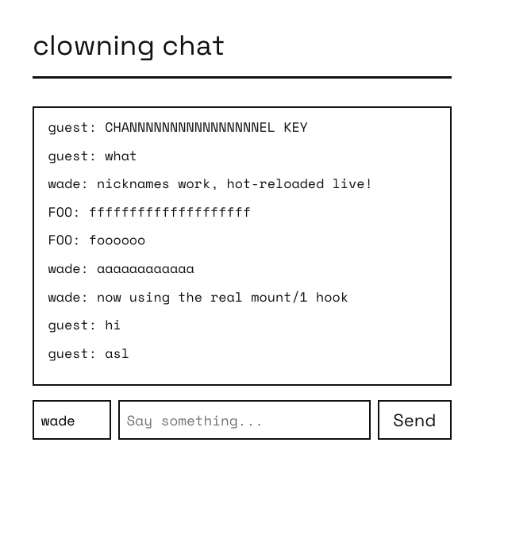

#+TITLE: CONCRETE 008: A Live Chat Across Two Nodes
#+HTML_HEAD: <meta name="description" content="Building a real-time, cross-node chat with Concrete's SSE primitives, then adding a feature to it with a live hot code reload" />
#+FILETAGS: :systems:erlang:concrete:

#+OPTIONS: ^:nil num:nil toc:nil date:nil author:nil html-postamble:nil
#+SETUPFILE: "./setupfile.org"
#+INCLUDE: "navbar.html" export html
#+HTML_HEAD: <meta name="description" content="Building a real-time, cross-node chat with Concrete's SSE primitives, then adding a feature to it with a live hot code reload" />

#+ATTR_HTML: :align center
#+ATTR_ORG: :align center

* Summary:
:PROPERTIES:
:ID:       20031431-B7E7-4BE8-A523-889B4DB26E63
:PUBDATE:  2026-08-14 Fri 10:00
:END:

Every earlier post in this series covers one mechanism at a time. This one builds something with several of
them at once: a chat room that runs live across two distributed Erlang nodes, pushes messages
to every open browser with no polling, connects itself the moment the page loads, and gets a new
feature added to it -- while it keeps running, with real users connected -- through nothing but a
recompile and a network load. No restart, no lost history.

* The Big Parts
:PROPERTIES:
:ID:       820D8324-0F42-4686-81BD-ACBF90774741
:PUBDATE:  2026-08-14 Fri 10:00
:END:

I know it's a bit of an odd name, but I was simply clowning around, hence the =clowning= prefix.

Three pieces:

- =clowning_chat=, a =gen_server= holding message history, replicated to every connected node.
- =clowning_chat_page=, a Concrete page that connects to a live event stream the moment it loads, and renders every message -- past and future -- through one code path.
- A plain =/chat/post= route for sending, deliberately outside Concrete's own command dispatch.

Open two nodes, each serving the page on its own port, and a message typed into one browser shows
up in the other immediately. Two browser tabs on the *same* node see it too, obviously, but the
point of running two nodes is that neither one is special: whichever node's =clowning_chat= a browser happens
to be talking to, the message still gets everywhere.

* The Chat History
:PROPERTIES:
:ID:       D686CC3F-4CCB-4357-B484-E01DA2478333
:PUBDATE:  2026-08-14 Fri 10:00
:END:

#+BEGIN_SRC erlang
-module(clowning_chat).
-behaviour(gen_server).

-export([start_link/0, post/2, history/0]).
-export([init/1, handle_call/3, handle_cast/2, handle_info/2, terminate/2, code_change/3]).

-define(MAX_HISTORY, 200).

start_link() ->
    gen_server:start_link({local, ?MODULE}, ?MODULE, [], []).

post(Author, Text) ->
    gen_server:call(?MODULE, {post, Author, Text}).

history() ->
    gen_server:call(?MODULE, history).

init([]) ->
    {ok, #{messages => []}}.

handle_call({post, Author, Text}, _From, State) ->
    Msg = #{author => Author, text => Text, ts => erlang:system_time(millisecond)},
    NewState = append(Msg, State),
    gen_server:abcast(nodes(), ?MODULE, {replicate, Msg}),
    concrete_pubsub:broadcast(<<"chat_room">>, {message, Msg}),
    {reply, ok, NewState};
handle_call(history, _From, #{messages := Messages} = State) ->
    {reply, lists:reverse(Messages), State}.

handle_cast({replicate, Msg}, State) ->
    {noreply, append(Msg, State)}.

append(Msg, #{messages := Messages} = State) ->
    State#{messages := lists:sublist([Msg | Messages], ?MAX_HISTORY)}.
#+END_SRC

Two things happen on every post, and neither one is Concrete-specific -- this is a
plain =gen_server= doing plain OTP:

=gen_server:abcast(nodes(), ?MODULE, {replicate, Msg})= sends the message as a real cast
to every node currently connected to this one, so both nodes' history stays identical no
matter which node a given browser posted to.

=concrete_pubsub:broadcast(<<"chat_room">>, {message, Msg})= is a wrapper over Erlang's =pg=
(process groups): =concrete_pubsub:subscribe/2= joins a channel, =broadcast/2= sends to every member.

Because =pg= is cluster-wide the moment two nodes are connected (=net_adm:ping/1=, same as always), a
browser subscribed on node2 gets a message posted on node1 with no extra plumbing at all. The channel
is a binary, =<<"chat_room">>=, matching what the URL-based subscriber below joins with -- =pg= channels
are just terms, and two different terms are two different channels even if one prints the same.

* What Runs When the Page Loads
:PROPERTIES:
:ID:       0A8704E4-9091-4505-A390-14C64788B13E
:PUBDATE:  2026-08-14 Fri 10:00
:END:

Concrete's page behaviour has a =mount/1= callback for exactly this -- the same idea Phoenix
LiveView's own =mount= callback covers, though the mechanism underneath is entirely different
(LiveView's runs server-side over a socket; Concrete's runs compiled to JavaScript, in the
browser). The runtime calls it once, client-side only, right after this page's markup is in the
real DOM.

No template wiring needed -- it isn't called from =.slab= the way ={@count}= reads a state value;
the client runtime calls =mount/1= directly, right after the first render, the same way a click
calls =action/3=.

#+BEGIN_SRC html

  <h1>clowning chat</h1>
  

  

    <input id="nick-input" type="text" placeholder="nickname" autocomplete="off" class="chat-nick">
    <input id="chat-input" type="text" placeholder="Say something..." autocomplete="off">
    <button data-chat-send="1">Send</button>
  

#+END_SRC

=mount/1= takes the whole =Component= map, not just the message list -- it comes in already
wire-decoded, the exact same shape =action/3='s third argument already is, so matching it out
with =#{state := #{messages := History}}= reads no differently than an =action/3= clause does.

=mount/1= runs browser-side only. Unlike =render/1=, it's never part of building the page's
first HTML on the server, so there's nothing here that needs to guard against running twice:

#+BEGIN_SRC erlang
mount(#{state := #{messages := History}}) ->
    lists:foreach(fun(M) -> render_message(M) end, History),
    dom:on_keydown(<<"chat-input">>, <<"Enter">>, clowning_chat_page, send_key),
    dom:on_click(<<"composer">>, <<"data-chat-send">>, clowning_chat_page, send_click),
    sse:connect(<<"/concrete/sse/chat_room">>, clowning_chat_page, on_message).
#+END_SRC

Three things get wired up here, and none of them run =do_send/0= (covered in the next section)
directly -- =send_key/0= and =send_click/1= are the two small functions in between, and they
exist because =dom:on_keydown/4= and =dom:on_click/4= don't call back with the same arity:

#+BEGIN_SRC erlang
%% dom:on_keydown/4 calls Module:Function/0 -- no arguments.
send_key() ->
    do_send().

%% dom:on_click/4 calls Module:Function/1 -- with the clicked element's
%% [data-chat-send] attribute value, unused here and just discarded.
send_click(_Value) ->
    do_send().
#+END_SRC

The =sse:connect/3= line is doing the same kind of thing: it opens a stream to the given URL,
and the last two arguments are a module and function to call -- =on_message/1= below -- once
per event, for as long as the tab stays open.

#+BEGIN_SRC erlang
on_message({message, Msg}) ->
    render_message(Msg).

render_message(#{author := Author, text := Text}) ->
    Html = <<"
",
             (escape_html(Author))/binary, ": ",
             (escape_html(Text))/binary, "
">>,
    dom:append_html(<<"messages">>, Html),
    dom:scroll_to_bottom(<<"messages">>).
#+END_SRC

=escape_html/1= is a small hand-rolled recursive pass over the binary --
worth calling out because it's *not* =binary:replace/4=. The client compiler cross-compiles
whatever real Erlang a reachable call resolves to, and =binary:replace/4='s actual OTP
implementation leans on bit-syntax the client encoder doesn't support yet. A plain recursive
walk over the bytes sidesteps that entirely, and is easier to read:

#+BEGIN_SRC erlang
escape_html(Bin) ->
    escape_html(Bin, <<>>).

escape_html(<<>>, Acc) -> Acc;
escape_html(<<38, Rest/binary>>, Acc) -> escape_html(Rest, <<Acc/binary, "&amp;">>);
escape_html(<<60, Rest/binary>>, Acc) -> escape_html(Rest, <<Acc/binary, "&lt;">>);
escape_html(<<62, Rest/binary>>, Acc) -> escape_html(Rest, <<Acc/binary, "&gt;">>);
escape_html(<<34, Rest/binary>>, Acc) -> escape_html(Rest, <<Acc/binary, "&quot;">>);
escape_html(<<C, Rest/binary>>, Acc)  -> escape_html(Rest, <<Acc/binary, C>>).
#+END_SRC

* Sending, Outside Concrete's Own Dispatch
:PROPERTIES:
:ID:       CC51F193-2BCD-4B90-9620-99D992FA62EB
:PUBDATE:  2026-08-14 Fri 10:00
:END:

Every earlier post in this series sends data to the server
with =?js:call(<<"Client">>, dispatchCommand, ...)=. That's the right tool when the response should feed
back into page state.

It's the wrong tool here: =dispatchCommand='s response handler always ends in a re-render,
the same rebuild described above, which would wipe the chat log right back to the static
template on every message sent.

So sending goes around it, with =http:post_json/2= -- a genuine fire-and-forget POST, no
response handling, straight to a small plain =cowboy= handler instead of
Concrete's =/concrete/command= route. This is =do_send/0=, the function =send_key/0= and
=send_click/1= call:

#+BEGIN_SRC erlang
do_send() ->
    Text = dom:get_value(<<"chat-input">>),
    Nick = dom:get_value(<<"nick-input">>),
    dom:set_value(<<"chat-input">>, <<>>),
    http:post_json(<<"/chat/post">>, #{text => Text, author => Nick}).
#+END_SRC

#+BEGIN_SRC erlang
-module(clowning_chat_post_handler).
-export([init/2]).

init(Req0, State) ->
    {ok, Body, Req1} = read_body(Req0),
    {ok, Params} = thoas:decode(Body),
    #{<<"text">> := Text} = Params,
    Author = maps:get(<<"author">>, Params, <<"guest">>),
    case string:trim(Text) of
        <<>> -> ok;
        Trimmed -> clowning_chat:post(Author, Trimmed)
    end,
    {ok, cowboy_req:reply(204, Req1), State}.
#+END_SRC

Nothing renders as a direct result of sending. The sender finds out their own message went through the exact same way every other browser does -- it comes back over the SSE stream into =on_message/1=, a moment later. One code path renders every message, always, regardless of who sent it or which node they're talking to.

* Hot-Reloading Onto a Running Node
:PROPERTIES:
:ID:       8335E9D6-9441-4733-A438-ED4339D921FE
:PUBDATE:  2026-08-14 Fri 10:00
:END:

None of this required stopping either node. clowning ships two Makefile targets that start long-lived, named, distributed Erlang nodes:

#+BEGIN_SRC shell
$ make node1     # web app on http://localhost:4000/
$ make node2     # web app on http://localhost:4001/
#+END_SRC

Pushing a change onto both of them, once they're already up, is a disposable third
node that connects to both, recompiles nothing itself, and issues a network load --
[[https://www.erlang.org/doc/apps/stdlib/c.html#nl/1][=c:nl/1=]] -- which pushes the freshly
built =.beam= to every node connected to it, and reloads it there.

#+BEGIN_SRC shell
$ rebar3 compile
$ erl -pa _build/default/lib/*/ebin \
      -name reload@127.0.0.1 -setcookie clowning_cookie -noshell \
      -eval "
        net_adm:ping('clowning1@127.0.0.1'),
        net_adm:ping('clowning2@127.0.0.1'),
        io:format(\"~p~n\", [c:nl(clowning_chat_page)]),
        init:stop()."
abcast    # printed by the io:format/2 call above -- c:nl/1's own return value
#+END_SRC

It's important to note that =gen_server= callbacks always dispatch fully-qualified
(=Module:Function/Arity=), so any process built on one picks up new code on its
very next message, automatically.

A brand-new module, or a brand-new supervised child, needs one extra line the first time
only: =supervisor:start_child(clowning_sup, ChildSpec)=, run once from the same disposable
connection, adds it to the running tree without restarting anything already there.

* Adding a Feature, Live
:PROPERTIES:
:ID:       2D24C45A-1A85-419B-B06D-DCCA6EB134D0
:PUBDATE:  2026-08-14 Fri 10:00
:END:

With the chat already running on both nodes, real messages in its history, we're going to add a nickname field.
The field value will persist in the browser's =localStorage= so it survives a reload, and gets sent along with
every message instead of a hardcoded author.

The template gains one input, next to the ones already there:

#+BEGIN_SRC html
<input id="nick-input" type="text" placeholder="nickname" autocomplete="off" class="chat-nick">
#+END_SRC

=mount/1= sets it from storage on connect, and wires =Enter= to save a new one. Here's the updated page
=mount/1= function:

#+BEGIN_SRC erlang
mount(#{state := #{messages := History}}) ->
    lists:foreach(fun(M) -> render_message(M) end, History),
    dom:set_value(<<"nick-input">>, stored_nick()),
    dom:on_keydown(<<"nick-input">>, <<"Enter">>, clowning_chat_page, save_nick),
    dom:on_keydown(<<"chat-input">>, <<"Enter">>, clowning_chat_page, send_key),
    dom:on_click(<<"composer">>, <<"data-chat-send">>, clowning_chat_page, send_click),
    sse:connect(<<"/concrete/sse/chat_room">>, clowning_chat_page, on_message).
#+END_SRC

And the two related functions =mount/1= wires up:

#+BEGIN_SRC erlang
stored_nick() ->
    case dom:local_storage_get(<<"chat_nick">>) of
        undefined -> <<"guest">>;
        Nick -> Nick
    end.

save_nick() ->
    dom:local_storage_set(<<"chat_nick">>, dom:get_value(<<"nick-input">>)).
#+END_SRC

=do_send/0= reads whatever's currently in that field alongside the message text, and the post handler
takes an =author= key instead of assuming =guest=:

#+BEGIN_SRC erlang
do_send() ->
    Text = dom:get_value(<<"chat-input">>),
    Nick = dom:get_value(<<"nick-input">>),
    dom:set_value(<<"chat-input">>, <<>>),
    http:post_json(<<"/chat/post">>, #{text => Text, author => Nick}).
#+END_SRC

That's the entire feature. Save the file, compile it, then load it.

#+BEGIN_SRC shell
$ rebar3 compile
$ erl -pa _build/default/lib/*/ebin \
      -name reload@127.0.0.1 -setcookie clowning_cookie -noshell \
      -eval "
        net_adm:ping('clowning1@127.0.0.1'),
        net_adm:ping('clowning2@127.0.0.1'),
        io:format(\"~p~n\", [c:nl(clowning_chat_page)]),
        io:format(\"~p~n\", [c:nl(clowning_chat_post_handler)]),
        init:stop()."
#+END_SRC

Reload either open tab and the nickname box is there. Every message already in history,
posted minutes earlier, by the old code -- is still exactly where it was. Nothing restarted,
nothing disconnected, nothing lost. That's the whole pitch of the BEAM's hot code loading in one
sentence: the process holding your state and the code defining your behavior are two separate things,
and you're always free to swap the second one without touching the first.

* Resources:
:PROPERTIES:
:ID:       27B2A171-A404-46AE-BC38-361EA6C1A5E9
:PUBDATE:  2026-08-14 Fri 10:00
:END:

https://github.com/wmealing/concrete

[[./concrete-intro.html][Concrete 001: An Introduction]]

[[./concrete-counter.html][Concrete 002: Hello, Counter]]

[[./concrete-pages.html][Concrete 003: Pages, Routing, and Layouts]]

[[./concrete-templates.html][Concrete 004: Inside the .slab Parser]]

[[./concrete-js-interop.html][Concrete 005: JavaScript Interop]]

[[./concrete-js-promises.html][Concrete 006: Catching JavaScript Promises]]

[[./concrete-command-dispatch.html][Concrete 007: Reporting to the Server from a Client Action]]

[[./concrete-live-chat.html][Concrete 008: A Live Chat Across Two Nodes]]
