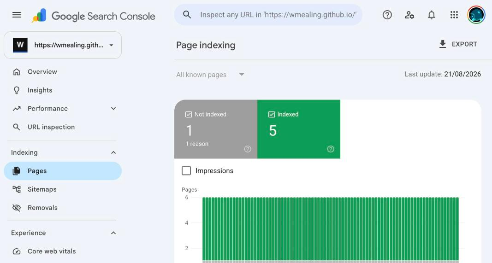
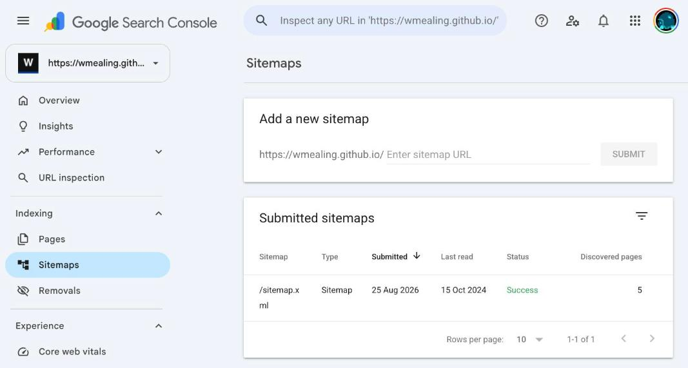
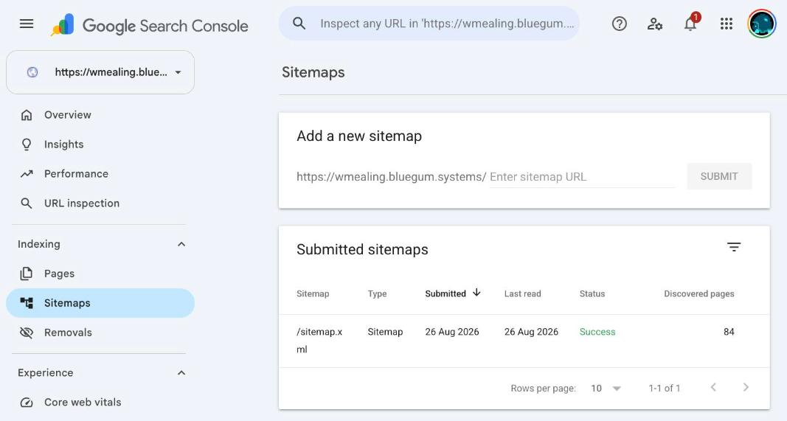

#+TITLE: Google hates my site
#+FILETAGS: :tooling:

#+OPTIONS: ^:nil num:nil toc:nil date:nil author:nil html-preamble:t html-postamble:nil
#+SETUPFILE: "./setupfile.org"
#+INCLUDE: "navbar.html" export html
#+HTML_HEAD: <meta name="description" content="Five pages indexed out of eighty-four: what was actually broken" />

* Summary:
:PROPERTIES:
:ID:       0B1E4C7A-9D3F-4A21-B8E6-5C7D2F914A3B
:PUBDATE:  2026-08-26 Wed 00:57
:END:

Google had indexed five pages of this site. There are eighty-four.

This is the record of what was actually broken, with the numbers from Google
Search Console at each step. Some of it was my fault. Some of it was not.

* The state I started from
:PROPERTIES:
:ID:       1C2F5D8B-AE40-4B32-C9F7-6D8E3A025B4C
:PUBDATE:  2026-08-26 Wed 00:57
:END:

Search Console, property =https://wmealing.github.io/=:

Five pages indexed. One not indexed, reason "Crawled - currently not indexed".
Six URLs total known to Google, out of eighty-four that exist.

The sitemap report explained why:

Submitted 25 Aug 2026. *Last read 15 Oct 2024.* Five pages discovered.

Status: "Success".

* What was broken on my end
:PROPERTIES:
:ID:       2D3A6E9C-BF51-4C43-DA08-7E9F4B136C5D
:PUBDATE:  2026-08-26 Wed 00:57
:END:

Three real defects, all mine.

** The sitemap generator emitted a doubled slash

The =Makefile= runs =sitemap_maker --url https://wmealing.github.io/=. That tool
joins the base URL, which ends in a slash, with paths that also begin with a
slash. The result:

#+BEGIN_EXAMPLE
<loc>https://wmealing.github.io//index.html</loc>
<loc>https://wmealing.github.io//systems.html</loc>
#+END_EXAMPLE

68 of 80 entries were like this. GitHub Pages serves =//page.html= with a 200,
so nothing looked broken. They are still distinct URLs, and nothing on the site
links to them.

Fixed by collapsing the slash after generation, so it cannot come back:

#+BEGIN_SRC makefile
  sed -i '' 's#<loc>https://wmealing.github.io//#<loc>https://wmealing.github.io/#g' output.xml
#+END_SRC

** The sitemap was missing a quarter of the site

=sitemap_maker= crawls two levels deep from the homepage. Pages not reachable in
two hops were never in the file. Seventeen live pages, including =systems-cobol=,
=tooling-janet=, =barista-lfe= and =projects=, were simply absent.

After deduplicating and adding them back: 84 unique URLs, all verified 200.

** robots.txt never declared the sitemap

#+BEGIN_EXAMPLE
User-agent: *
Allow: /
#+END_EXAMPLE

That was the entire file. No =Sitemap:= line. Added one, and disallowed the five
HTML fragments that are includes rather than pages.

* The bug I found by accident
:PROPERTIES:
:ID:       3E4B7F0D-C062-4D54-EB19-8F0A5C247D6E
:PUBDATE:  2026-08-26 Wed 00:57
:END:

While changing the domain, =xmllint= rejected my own RSS feed:

#+BEGIN_EXAMPLE
rss.xml:25: namespace error : Failed to parse QName ':component'
<description>Giving <:component> a persistent identity, a mount/2 hook, and a re
                               ^
#+END_EXAMPLE

=generate-rss.escript= interpolated titles and descriptions with =~s= and no
escaping. One post's description mentions =<:component>=, which emitted an
unparseable tag. XML parsing aborts at the first error, so *every item after
that one was invisible to feed readers* (not that I have any anyway) — not just
the offending entry.

This had been live. Fixed with an =escape_xml/1= over =&=, =<=, =>=, ="= and ='=.

* Where Google failed me
:PROPERTIES:
:ID:       4F5C8A1E-D173-4E65-FC2A-9A1B6D358E7F
:PUBDATE:  2026-08-26 Wed 00:57
:END:

The defects above are mine. I found them, I fixed them, I have shown you the
diffs. Now the other half.

** "Success" on a file it had not opened in 22 months

The status column said *Success*. The last-read column said *15 Oct 2024*.
Simultaneously. For nearly two years. While I kept resubmitting.

Whatever "Success" is measuring, it is not whether Google has looked at your
sitemap this decade. It reports that some fetch, at some unstated point in the
past, parsed. A file last read when I still had a different job is labelled with
the same cheerful green word as one read this morning.

There is no warning. No staleness flag. No amber. Nothing anywhere in the
interface says "we have ignored this for 22 months" — the single piece of
evidence is a date in an adjacent column that you have to know to distrust.
Google knows exactly how long it has been. It renders that number, right there,
next to the word Success, and declines to draw the obvious conclusion on your
behalf.

** The only lever provided is documented not to work

Resubmitting updates "Submitted" to today's date and leaves "Last read" at
15 Oct 2024. It changes nothing. Google says so itself, in its own dialog:

#+BEGIN_QUOTE
Submitting a page multiple times will not change its queue position or priority.
#+END_QUOTE

Read that again in context. The problem is "Google has not fetched my sitemap."
The interface offers exactly one button. The button is documented, by Google, to
have no effect on the thing you are trying to change. It exists to update a
timestamp in a column, for you to look at.

** A diagnostic that cannot distinguish between two opposite problems

URL Inspection on =cellium-tabs.html=, a URL that was *in the sitemap I had
submitted*:

#+BEGIN_EXAMPLE
Page is not indexed: URL is unknown to Google
Discovery
  Sitemaps        No referring sitemaps detected
  Referring page  None detected
#+END_EXAMPLE

"No referring sitemaps detected." The URL was in the sitemap. The sitemap was
submitted, accepted, and marked Success.

This message is emitted identically whether you forgot to list the URL or Google
never bothered to read the file listing it. Those have nothing in common. One is
my bug and takes a minute. The other is Google not doing the job and takes a new
domain. The tool whose entire purpose is telling you why a page is not indexed
cannot tell them apart, and does not hint that it can't.

** Reports stale by days, presented as current

The Pages report above is stamped "Last update: 21/08/2026" — five days old when
I screenshotted it, sitting under numbers displayed as though they described the
site as it exists.

URL Inspection was worse: it served me verdicts derived from a crawl twenty-three
minutes older than the deploy they were describing, with no indication that the
HTML it was reasoning about had already been replaced. You cannot fix what you
cannot measure, and the measurements are a week behind and never say so.

** "Crawled - currently not indexed", and no way to learn more

Fetched successfully. Crawl allowed: yes. Indexing allowed: yes. Not indexed.

That is the entire explanation. There is no detail view, no reason code, no
appeal. A machine looked at my site, decided against it, and the interface for
understanding why is a five-word phrase and a help article telling you to write
better content.

And the crawl behind that judgement was from 9 May 2026 — when Google could
reach roughly five pages of an eighty-four page site, because it had not read
the sitemap since 2024. It formed a view of the site from a fraction it had
chosen not to expand, and then reported that view back to me as a verdict on the
whole thing.

* The part that is hard to read any other way
:PROPERTIES:
:ID:       5A6D9B2F-E284-4F76-0D3B-AB2C7E469F80
:PUBDATE:  2026-08-26 Wed 00:57
:END:

I moved the site to a domain I own, =wmealing.bluegum.systems=. One CNAME:

#+BEGIN_EXAMPLE
Type: CNAME    Name: wmealing    Data: wmealing.github.io    TTL: 4 hrs
#+END_EXAMPLE

Then added it as a Search Console property and submitted the same sitemap file.

*Submitted 26 Aug 2026. Last read 26 Aug 2026. 84 pages discovered.*

Read on submission. All 84 URLs enumerated.

The same file, generated by the same script, served from the same GitHub Pages
infrastructure, went unread for 22 months on a =github.io= subdomain and was
read within seconds on a domain I pay for. My sitemap bugs were real and worth
fixing, but they were not what kept the file unread — the corrected sitemap sat
unread on the old domain too.

The difference was the address.

* Current state
:PROPERTIES:
:ID:       6B7E0C3A-F395-4A87-1E4C-BC3D8F570A91
:PUBDATE:  2026-08-26 Wed 00:57
:END:

| Metric              | Before      | After       |
|---------------------+-------------+-------------|
| Sitemap last read   | 15 Oct 2024 | 26 Aug 2026 |
| Pages discovered    |           5 |          84 |
| Sitemap URLs valid  |       12/80 |       84/84 |
| RSS feed parses     | no          | yes         |

Five commits: sitemap URLs, the domain move, RSS escaping, and repointing the
generated HTML.

Discovered is not indexed. Eighty-four pages are now known to Google; how many
it indexes, and when, is not something I control. What I can say is that the
specific failure — Google could not enumerate this site — is fixed, and the
sitemap report now proves it rather than merely claiming "Success".

* Conclusion
:PROPERTIES:
:ID:       7C8F1D4B-A406-4B98-2F5D-CD4E9A681B02
:PUBDATE:  2026-08-26 Wed 01:12
:END:

The part that bothers me is not that it was broken. Things break. It is that
nothing told me.

There was no alert. No email. No red banner. The word on the sitemap row was
=Success=, in green, for the entire 22 months. The site did not appear to be
failing; it appeared to be fine, and was simply absent from search results in a
way I had no reason to look into. I only found it because I had a couple of days
free and got stubborn enough to stop believing the interface and start checking
it — running =curl= against my own URLs, =dig= against my own DNS, diffing what
Google claimed to have crawled against what was actually being served.

Nobody does that. Somebody with a job, who writes a blog on weekends, posts a
thing and assumes the machinery works, because every screen they are shown says
it is working. They will never find this. They will just quietly not exist, and
conclude that nobody wanted to read it.

And for a small site, not being indexed is not a degraded experience. It is
death. There is no partial credit. You are not ranked badly, you are not on page
nine — you are not there at all. Nobody finds the site, so nobody links to the
site, so there is no signal that the site is worth crawling, so nobody finds the
site. That loop does not resolve on its own, and the tooling that is supposed to
help you notice you are in it labelled my situation =Success=.

Maybe this stops mattering. Maybe the discovery path stops being a search box
and becomes whatever the LLMs are doing, and the thing that matters is that a
crawler actually read the page and can answer a question about it. There is
something appealing about that after two days of arguing with a system that
could not tell me whether it had opened a file.

But I doubt it will be better, and I would not bet on it. It is the same shape
of problem with different branding: someone else's crawler, someone else's
budget, someone else's undisclosed criteria for whether you are worth including,
and no obligation to tell you the answer or explain it. At least Google gave me
a =Last read= column. It took me 22 months to learn to distrust that column, but
it was there. I am not confident the next lot will render the number at all.

The sitemap is fixed. The feed parses. The pages are discovered. I still do not
control whether any of it gets indexed, and neither do you.
