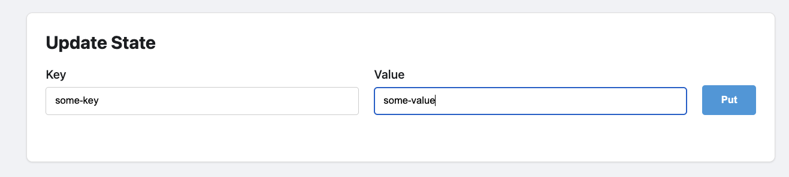
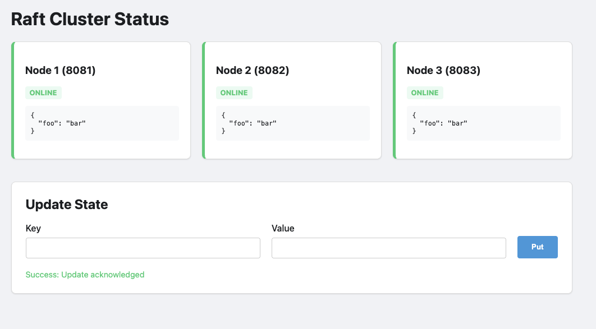
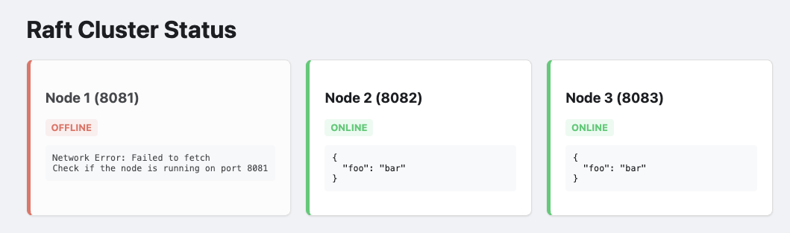
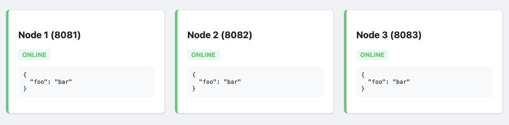

#+TITLE: Building a 3-Node Cluster with Erlang and 'ra'
#+FILETAGS: :systems:
#+OPTIONS: ^:nil num:nil toc:nil date:nil author:nil html-postamble:nil
#+SETUPFILE: "./setupfile.org"
#+INCLUDE: "navbar.html" export html
#+HTML_HEAD: <meta name="description" content="Using RA for clustering with native OTP 27+ JSON" />

* Summary
:PROPERTIES:
:ID:       60AE0A49-5E08-448F-AF5B-5CC3C61961F1
:PUBDATE:  2026-03-12 Thu 04:15
:END:

In this post, we’re going to build a small, highly available Key-Value store using ra, an implementation of the
Raft consensus protocol.  The "Wade" web server (not made by myself) is running to present this data to
the end user.

* Introduction
:PROPERTIES:
:ID:       73F6284C-CC88-43AC-9643-C19D3007F480
:PUBDATE:  2026-03-12 Thu 04:15
:END:

If you’ve spent any time in the Erlang ecosystem, you’ve heard the mantra: "Let it crash". Erlang supervisors are
world-class at restarting processes and returning a system to a clean state.

But there is a ceiling to what a supervisor can do. A supervisor can restart a process, but it can't magically recover
a mailbox that was purged during a crash. It can't synchronize state across a physical network partition.

This feature allows data to be synchronised across all 'nodes' in the cluster, and have the same code deployed for all
nodes in the group.

This demonstration uses erlangs built-in distribution mechanism for communication, the raft protocol as a method of
resolving cluster state, and a webserver to display the internal state.

There was a [[https://www.reddit.com/r/elixir/comments/1rlrss4/i_built_raft_consensus_from_scratch_in_elixir/][post]] on the [[https://www.reddit.com/r/elixir/comments/1rlrss4/i_built_raft_consensus_from_scratch_in_elixir/][erlang subreddit]] which talked about an elixir.  That poster talks about his struggles on implementation,
instead of that i plan to talk about the practical side while using 'ra' in  erlang.

* The Architecture:
:PROPERTIES:
:ID:       6408FA58-6D4A-43E7-917D-FC9921C29F89
:PUBDATE:  2026-03-12 Thu 04:15
:END:

In this specific implementation, I've chosen some useful erlang libraries:

- [[https://github.com/rabbitmq/ra][Ra: A Raft Implementation]] : This is the engine. It handles the KV storage and ensures every
   node in the cluster agrees on the order of operations.

- [[https://github.com/Green-Mice/wade][Wade]]: This handles our HTTP GET/POST requests.

In our example, there will be three nodes on the same IP, each 'node' will have its own 'wade' webserver
running on their own ip, each 'nodes' special config is in the ./config directory.

* Getting "Consensus" and dealing with failures:
:PROPERTIES:
:ID:       50AE52CB-36EC-4A2A-8E4C-4E327EBD1E90
:PUBDATE:  2026-03-12 Thu 04:15
:END:

The [[https://raft.github.io/][Raft Consensus algorithm]] is a distributed consensus algorithm between different 'nodes'.
When the cluster starts, it DOES require all the nodes to connect and join the cluster.  Only
after the cluster is formed can the system safely deal with failure.

The internal tooling that the "RA" protocol uses, requires each node to store a log of its
state.  When the node fails or is added, the log is replayed on the node that does not contain
the most recent data set.

Internallly this is handled by the =ra:process_command/2= function.  That command is replicated
across each node in the cluster. Only once a majority of nodes have acknowledged it
(aka quorum) does the state actually update across the nodes.

* The implementation:
:PROPERTIES:
:ID:       AEB40720-920B-4C9A-B834-0455FC21F310
:PUBDATE:  2026-03-12 Thu 04:15
:END:

To get this running, we’ll us =rebar3=. Our goal is to have the =ra= library and our
=wade= endpoints initialized as part of the application startup, lets do that.

** 1. Dependencies and Profiles
:PROPERTIES:
:ID:       AED30F3C-0293-4723-AFD2-FC9C06234B11
:END:

Create a new app:

#+BEGIN_SRC sh
$ rebar3 new app ha_app
#+END_SRC

In =ha-ap/rebar.config=, we define our dependencies and setup profiles so we can run
three nodes, each with their own relevant configuration file.

#+BEGIN_SRC erlang
  {deps, [ {ra, "2.0.0"}, {wade, "0.1.0"} ]}.

  {profiles, [
              {node1, [{shell,  [{config, "config/node1.config"}]}]},
              {node2, [{shell,  [{config, "config/node2.config"}]}]},
              {node3, [{shell,  [{config, "config/node3.config"}]}]}]}.
#+END_SRC

In this example, we'll have this running on a single machine, with each 'node' on
a different TCP port, because its easier.

** 2. The Supervisor and Cluster Init
:PROPERTIES:
:ID:       056F5ED5-EF7E-4CD0-B28E-B092280EEF5C
:END:

The first step would be to create module that implements the 'ra_machine'
behavior.  This is not a gen_server, this defines the 'Machine Module' and then
pass it to the cluster initialization (in ra:start_cluster/4).

#+BEGIN_SRC erlang
  init([]) ->
      %% Each node needs its own identity in the RA cluster
      Id = {kv_store, node()},

      %% The Machine logic
      Machine = {module, my_kv_machine, #{}},

      %% Define the cluster members
      Nodes = [
               {kv_store, 'node1@127.0.0.1'},
               {kv_store, 'node2@127.0.0.1'},
               {kv_store, 'node3@127.0.0.1'} ],

      RaSpec = #{ id => ra_cluster_init,
                  start => {ra, start_cluster, [default, kv_store, Machine, Nodes]},
                  restart => transient },

  {ok, {#{strategy => one_for_all, intensity => 5, period => 10}, [RaSpec]}}.

#+END_SRC

** 3. The cluster bootstrapper.
:PROPERTIES:
:ID:       69E30B17-F78A-4854-9C51-312B479F804B
:END:

The ha_app_bootstrapper.erl module is a gen_server responsible for ensuring the Raft cluster is initialized
and that the local node correctly joins or restarts its participation in that cluster.

*** How it "Calls Itself" (The Bootstrap Loop)
:PROPERTIES:
:ID:       AAB194E6-C03D-4679-A646-D7941AC52026
:END:

The module uses Erlang's message-passing system to create a non-blocking retry loop.
This prevents the node from hanging if peers are not yet online.  This is the method
that is discussed in [[https://www.erlang-in-anger.com/][Erlang in Anger]], (Chapter 2.2) which talks about providing guarantees
during the initialization phase.

In our ha_boot ( ha_app_bootstrapper.erl ), in it:

   * Recurrence: Inside handle_info(bootstrap, State), if the cluster isn't ready or a condition isn't met (e.g., the Raft system
     hasn't started or the node is waiting for the leader), it uses timer:send_after(1000, bootstrap) to schedule the next
     attempt.
   * Why this pattern? It allows the gen_server to remain responsive to other system messages while "polling" for the cluster
     state in the background.

*** How it Starts or Joins the Cluster
:PROPERTIES:
:ID:       23B62ABC-20DB-4180-8FC1-119E072CBFFE
:END:

  The logic follows a specific hierarchy of checks to determine the node's role:

****  Step A: Network Connectivity
:PROPERTIES:
:ID:       F7E4FCBF-E7C4-4DEF-9E7C-473DA60DFB93
:END:

#+BEGIN_SRC erlang
  handle_info(bootstrap, State = #{nodes := Nodes}) ->
    ClusterName = kv_store,
    ServerId = {ClusterName, node()},

    %% Ensure we are connected to the network
    [net_adm:ping(N) || N <- Nodes],
#+END_SRC

  Before doing anything else, it runs **[net_adm:ping(N) || N <- Nodes]**. This ensures the underlying Erlang distribution is linked,
  allowing the [[https://github.com/rabbitmq/ra][ra library]] to communicate with peers.

****  Step B: Starting the Raft System
:PROPERTIES:
:ID:       C2A1DB9C-967A-4DF6-9994-FE840F9A41D9
:END:

  Raft is a consensus algorithm designed for managing a replicated log across a cluster of nodes, ensuring all nodes agree
  on the same data and state, even during failures.  Raft clusters usually need an odd number of nodes, (most commonly 3 or 5),
  to ensure a quorum while ensuring fault tolerance.

  A 3-node cluster tolerates 1 failure, while 5 nodes tolerate 2 failures. While a 2-node minimum is technically possible, it is
  not recommended due to lack of fault tolerance.

  To start, this code calls ra:overview(). If the system is not started, the module triggers ra_system:start_default().
  It then waits 500ms and uses timer to send a message back to this same function,  and  try again.  On the second time through
  the default ra_system should be started and the ra:overview() function should return map.

#+BEGIN_SRC erlang
  case ra:overview() of
      system_not_started ->
          ra_system:start_default(),
          timer:send_after(500, bootstrap),
          {noreply, State};
      #{servers := Servers} ->
          ...
#+END_SRC

****  Step C: Restarting or Joining (Existing State)
:PROPERTIES:
:ID:       E5916985-1386-410C-8B2E-1CD399627B9B
:END:

  If the Raft system is running, it checks if this node already knows about the kv_store cluster:
  
   * Restarting: If the server entry exists but the pid is undefined, it means the node was previously part of the cluster but
     stopped. It calls ra:restart_server(ServerId) to resume.
   * Already Running: If the server is already active, it simply updates the local cl_update tracker.

#+BEGIN_SRC erlang
   #{servers := Servers} ->
  case maps:find(ClusterName, Servers) of
      {ok, #{pid := undefined}} ->
          io:format("~p: Restarting existing server ~p~n", [node(), ClusterName]),
          ra:restart_server(ServerId),
          cl_update:set_started([{ClusterName, N} || N <- Nodes]),
          {noreply, State};
      {ok, _} ->
          cl_update:set_started([{ClusterName, N} || N <- Nodes]),
          {noreply, State};
      error ->
      ....
#+END_SRC

****  Step D: Bootstrapping a Fresh Cluster
:PROPERTIES:
:ID:       DC38FF05-3465-410C-920D-698395AFB8AE
:END:

#+BEGIN_SRC erlang
case node() == hd(Nodes) of
  true ->
    io:format("~p: Bootstrapping fresh cluster ~p~n", [node(), ClusterName]),
    Machine = {module, my_kv_machine, #{nodes => Nodes}},
    ServerIds = [{ClusterName, N} || N <- Nodes],

    case ra:start_cluster(default, ClusterName, Machine, ServerIds) of
        {ok, _, _} ->
           cl_update:set_started(ServerIds),
           {noreply, State};
         _ ->
            timer:send_after(1000, bootstrap),
            {noreply, State}
    end;
  false ->
    timer:send_after(1000, bootstrap),
    {noreply, State}
end
#+END_SRC

  If the kv_store cluster doesn't exist at all (the error case):

   * The Primary Node: Only the first node in the configuration list (hd(Nodes)) is allowed to initiate ra:start_cluster/4. This
     prevents race conditions where multiple nodes try to "create" the cluster simultaneously.

   * The Follower Nodes: If a node is not the first in the list, it does nothing except schedule a retry. It waits for the Primary
     node to successfully start the cluster; once the cluster is live, the follower will detect it in the next loop and join
     automatically via the ra library's internal replication.

     #+BEGIN_EXPORT html
     

     #+END_EXPORT

  Summary of Logic Flow
   1. Ping peers to establish Erlang distribution.
   2. Start the underlying Raft library if it's down.
   3. Recover the local Raft server if it was previously initialized but crashed.
   4. Elect the first node to define the cluster for the first time.
   5. Retry until the state is "Started."

 This would allow the cluster to start (from no state), allow any node to fail (master or otherwise) and be able to rejoin
 the cluster.  This doesn't allow any node that can join the 'erlang' distribution, but must be one of the specific nodes
 in the init() function.

 All the nodes run the 'same code, there is no special 'leader' code, this makes the distribution of the same code
 across all nodes.

#+BEGIN_SRC erlang
  init([]) ->
    Nodes = ['node1@127.0.0.1', 'node2@127.0.0.1', 'node3@127.0.0.1'],
    self() ! bootstrap,
    {ok, #{nodes => Nodes}}.
#+END_SRC

** 3. The State Machine (src/my_kv_machine.erl)
:PROPERTIES:
:ID:       E6EF6F57-463A-45D0-A520-B9CBFC7A6F2F
:END:

This is where the 'consensus' becomes 'state'. RA internally replays
commands to recreate the map.  This is a very simplified machine and
more complex "state machines" can be used to represent more specific data.
In this example i'm using a erlang map to represent the system state.

The RA team has more information on this, I strongly reccomend you check
out what the wrote regarding [[https://github.com/rabbitmq/ra/blob/main/docs/internals/STATE_MACHINE_TUTORIAL.md][writing a state machine]], which explains
how this work in depth better than I can do.

#+BEGIN_SRC erlang
-module(my_kv_machine).
-behaviour(ra_machine).
-export([init/1, apply/3]).

init(_Config) -> #{}.
  apply(_Meta, {put, Key, Val}, State) -> NewState = maps:put(Key, Val, State),
                                          {NewState, ok, []};
  apply(_Meta, get_all, State) -> {State, State, []}.
#+END_SRC

The document mentions "Providing a client API", which I had done in the in
the module cl_update.  My implementation is a gen_server which wraps
the important calls to =ra:process_command/2= function.

My example has removed all the type spec attribute because it ended up
making the information overload too high.

** 4. The Web Handler (src/wade_raft_handler.erl)
:PROPERTIES:
:ID:       7572DE76-020E-4605-8AB8-42CFFBF54C38
:END:

The web site  we have created is a simple method to show the operational status of
each of the cluster nodes.  Each of the nodes serves up the same data, querying
each of the nodes synchronized 'key/value' store.

#+BEGIN_SRC erlang
-module(wade_raft_handler).
-export([handle/2]).

handle(['GET', <<"/state">>], _Req) ->
      {ok, State, _Leader} = ra:local_query(kv_store, get_all),
      {200, [{"Content-Type", "application/json"}], json:encode(State)};

handle(['POST', <<"/data">>], Req) ->
      Body = wade_req:body(Req),
      #{<<"key">> := K, <<"val">> := V} = json:decode(Body),
      ra:process_command(kv_store, {put, K, V}),
      {201, [], <<"Accepted">>};

handle(['GET', <<"/">>], _Req) ->
      PrivDir = code:priv_dir(ha_app),
      {ok, Html} = file:read_file(filename:join([PrivDir, "index.html"])),
      {200, [{"Content-Type", "text/html"}], Html}.
#+END_SRC

The magic to query this correctly is in the =priv/ra_status.html= file.  It connects
and requests =/state to each fo the nodes in the server.  This is hardcoded to
only three nodes, with specific names, which was done to simplify the demonstration.

* Demonstration.
:PROPERTIES:
:ID:       B4799A48-35FD-4D0C-8056-2A47ADA434A0
:PUBDATE:  2026-03-12 Thu 04:15
:END:

Robert Virdings has a famous quote [[https://erlangforums.com/t/roberts-comment-and-now-for-the-tricky-bit-anyone-know-where-it-was-made/5154/3][and now for the tricky bit]].  You may hav enoticed
that this is at the start of the demonstration section, that is intentional.

** Step 1: The "Happy Path"
:PROPERTIES:
:ID:       A624DE15-32AE-4C26-85A1-E3F3CBA12DB6
:END:

Erlang has its own [[https://www.erlang.org/doc/apps/erts/erl_dist_protocol.html][distribution protocol]], which allows connected erlang nodes to be
able to communicate with other nodes using the built-in library using existing erlang
patterns even when dealing with executing and data across systems.

In the demonstration below, it does NOT use TLS. Using the Erlang Cookie mechanism without
TLS (Transport Layer Security) encryption is insecure for any environment exposed to a public
or untrusted network.  This security issue is well documented and implementing TLS for your
environment is an exercise for the reader.

Boot your nodes in three different terminals:

#+BEGIN_SRC sh
  rebar3 as node1 shell --name node1@127.0.0.1 --setcookie foo1234
  rebar3 as node2 shell --name node2@127.0.0.1 --setcookie foo1234
  rebar3 as node3 shell --name node3@127.0.0.1 --setcookie foo1234
#+END_SRC

Post some data to the leader with curl or visit the web page:

#+CAPTION: Submitting key/value via a browser.
#+ATTR_HTML: :alt "Form showing ability to update key / values" :title lets go :align center

This should appear in the display box above the form:

#+ATTR_HTML: :alt 'Current key value data"" :title "here we go" :align center

** Step 2: Terminating the node
:PROPERTIES:
:ID:       9BF215A5-B7F2-4203-B831-8B3B19F22621
:END:

Find the OS process for Node 1 (the Leader) and =kill -9= it. The cluster pauses
for a split second, heartbeats fail, and Nodes 2 and 3 hold an election. One is
promoted. The "Quorum" (2 out of 3) is maintained and the system stays
functional.

#+ATTR_HTML: :alt 'Current key value data"" :title "here we go" :align center

** Step 3: The Resurrection
:PROPERTIES:
:ID:       63605B72-840B-41B8-A49A-B57B4D9836D2
:END:

Bring Node 1 back online. It will realize it is behind. It will receive a log
update from the new Leader and jump forward in history instantly. The protocol
handles the "catching up" automatically.

It isnt exciting, but all nodes end up syncing up.

#+ATTR_HTML: :alt "All nodes show the same key state" :title "The recovery" :align center

Conclusion "In Erlang, we say 'Let it crash', fortunately recovering system state in an environment when you need
HA is quite decent.

** Trade offs
:PROPERTIES:
:ID:       96C4A8C6-B2EB-4272-9C82-9EAEA9098E86
:END:

Using the ra library for consensus in Erlang/OTP applications offers a robust, Raft-based alternative to erlangs built in 'mnesia'.

Its primary advantage  lies in its deep integration with the Erlang ecosystem, providing a gen_server-like interface that
simplifies the management of replicated state machines while handling the complexities of leader election and log replication.

However, these guarantees come with the inherent overhead of the Raft protocol, including increased network latency and disk latency
for write-ahead logging and the requirement for a strict quorum, which can lead to availability loss during significant
network partitions.

Furthermore, while ra excels at maintaining consistency for small to medium-sized states, managing very large states requires
careful snapshotting strategies to avoid excessive memory usage and long recovery times, making it a powerful tool that demands
a clear understanding of its operational limits.

When designing with this state, the state managed by the raft protocol could be a pointer to specific up to date resources that
clients can access.  This may significantly reduce recovery time and complexity.

The other unsaid trade off, is that this requires additional development work if you're going to use the erlang release process,
each cluster must be re-created at each of of the code upgrade points.

** Future.
:PROPERTIES:
:ID:       3E8C559F-A399-4181-8A6D-7B5F33DCA19C
:END:

It may be worth investigating, several operational and architectural challenges emerge
that warrant deeper investigation. Distributed systems built on Raft consensus, such as those utilizing
the ra library, offer robust consistency, but their real-world performance is heavily dictated by how they
handle network volatility and data density.

*** Operational Resilience and Partition Logic
:PROPERTIES:
:ID:       01CD2D13-3386-44FF-B47F-7AA716709E65
:END:

A primary focus of our upcoming research will be the nuance of failure detection. There is a significant
operational difference between a terminated node and a simple network partition. We aim to rigorously test
how the cluster behaves when links "flap" or experience high latency without a clean process exit. Understanding
these edge cases is vital for preventing unnecessary leader elections and ensuring the system remains available
during transient network instability.

*** Benchmarking State and Recovery
:PROPERTIES:
:ID:       9FF68A28-970D-4A43-963A-F87CEDDF0D02
:END:

Efficiency is another major frontier. We plan to quantify the "storage tax" of the State Machine—measuring
the disk footprint utilized by ra for its write-ahead logs and snapshots compared to the actual application
data. This data will serve as the foundation for benchmarking recovery times; specifically, how synchronization
latency scales as data volume grows.  If we figure out what size ends up being a bottleneck we can make
more educated decisions on what size data is right for an application.

*** Dynamic Scaling and Advanced Storage
:PROPERTIES:
:ID:       4F69AAEC-7650-41B7-8D0D-1CA0D7994ED8
:END:

Finally, we are exploring ways to move beyond the constraints of static configuration. Our goals include:

=Dynamic Membership=: Implementing methods to grow or shrink the cluster on the fly, removing the need for hardcoded node lists in sys.config.

=Optimized Bootstrapping=: Investigating how to start nodes with pre-loaded snapshots or sync directly from external data stores to bypass long replay cycles.

=Khepri Integration=: Researching the use of Khepri—RabbitMQ’s tree-like storage structure—as a high-level backend to manage state more efficiently than standard key-value approaches.

** Resources
:PROPERTIES:
:ID:       68D2D349-F5C2-4E10-BA26-988F35E23348
:END:

[[https://github.com/wmealing/ha_app][The 'ha_app" demonstration app referenced in this blog.]]

[[https://github.com/rabbitmq/ra][Ra GitHub Repository]]

[[https://www.erlang.org/doc/apps/stdlib/json.html][OTP json module documentation]]

[[https://github.com/rabbitmq/khepri][khepri project]]

